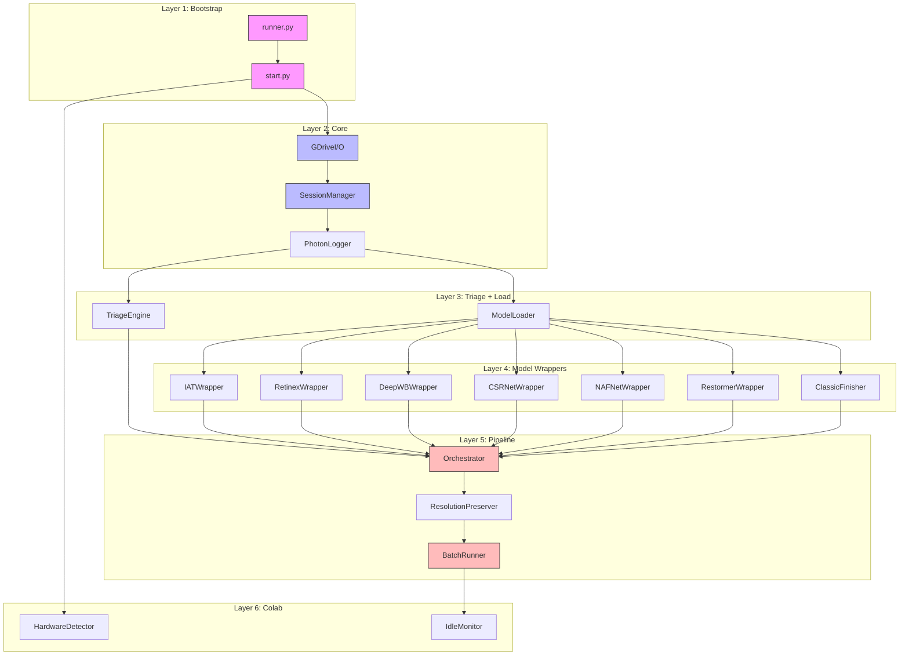
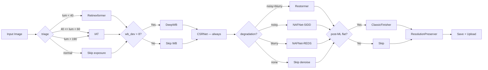

# Modules: PHOTON — Local ML Image Enhancement Pipeline

## 1. Global Tech Stack

| Component | Technology | Version | Purpose |
|---|---|---|---|
| **Runtime** | Python | 3.10+ | Colab default |
| **GPU Framework** | PyTorch | 2.x (CUDA 12.x) | ML inference |
| **Image I/O** | OpenCV | 4.x | Triage, CLAHE, resize |
| **Image I/O** | Pillow | 10.x | NAFNet bridge |
| **Array Ops** | NumPy | 1.24+ | All image math |
| **Drive API** | google-api-python-client | 3.x | OAuth, chunk I/O |
| **Drive Auth** | google-auth-oauthlib | 1.x | Colab auth |
| **Tqdm** | tqdm | 4.x | Progress bars |
| **ML: Exposure** | IAT (custom) | BMVC 2022 | Exposure correction |
| **ML: Low-Light** | Retinexformer | ICCV 2023 | Severe low-light |
| **ML: White Balance** | DeepWB (custom) | CVPR 2020 | WB correction |
| **ML: Retouching** | CSRNet (custom) | ECCV 2020 | Professional retouch |
| **ML: Denoise** | nafnetlib | ECCV 2022 | Denoising (SIDD) |
| **ML: Deblur** | nafnetlib | ECCV 2022 | Deblurring (REDS) |
| **ML: Heavy** | Restormer (opt) | CVPR 2022 | Combined degradation |

## 2. Global Data Model

| Entity | Key Fields | Relationships | Storage |
|---|---|---|---|
| **ImageJob** | file_id, filename, fingerprint, status, triage_metrics, pipeline_steps[], timing_ms | Belongs to Session | `/content/photon_session.json` |
| **Session** | session_id, started_at, stats{ok,skip,fail}, processed{} | Has many ImageJobs | `/content/photon_session.json` |
| **TriageResult** | mean_lum, contrast_std, wb_dev, wb_cast, noise_flag, blur_flag, blown_pct | 1:1 with ImageJob | In-memory (per-image) |
| **PipelineStep** | model_name, trigger_reason, before_metrics{}, after_metrics{}, duration_ms | Belongs to ImageJob | In-memory + log JSON |
| **DriveFile** | file_id, name, mime_type, size, md5_checksum, parent_folder_id | Belongs to DriveFolder | Drive API v3 |
| **DriveFolder** | folder_id, name, parent_id, web_view_link | Has many DriveFiles | Drive API v3 |

## 3. Module Orchestration

### Layer 1: Bootstrap (Colab Entry)
| # | Module | Complexity | Responsibility |
|---|---|---|---|
| 0 | `runner.py` | S | Clone repo, install deps, load Colab Secrets, launch start.py |
| 1 | `start.py` | S | Detect GPU, set PHOTON_MODE, launch main.py |

### Layer 2: Core Pipeline
| # | Module | Complexity | Responsibility |
|---|---|---|---|
| 2 | `GDriveI/O` | M | Drive API v3 — list, download, upload, create folder, retry |
| 3 | `SessionManager` | M | Fingerprint resume, session JSON, cross-runtime upload |
| 4 | `PhotonLogger` | S | Structured print log with timestamps and icons |
| 5 | `TriageEngine` | M | Classic CV metrics — luminance, contrast, WB, noise, blur detection |
| 6 | `ModelLoader` | M | Load all models to VRAM, log sizes, warm-up pass |

### Layer 3: Model Wrappers
| # | Module | Complexity | Responsibility |
|---|---|---|---|
| 7 | `IATWrapper` | S | Exposure correction (under/over-exposed) |
| 8 | `RetinexWrapper` | M | Severe low-light + tiling for large images |
| 9 | `DeepWBWrapper` | S | White balance — 3 outputs, select most neutral |
| 10 | `CSRNetWrapper` | S | Professional retouch with alpha blend |
| 11 | `NAFNetWrapper` | M | Dual model (SIDD denoise + REDS deblur) |
| 12 | `RestormerWrapper` | M | Optional heavy combined degradation |
| 13 | `ClassicFinisher` | S | CLAHE + Unsharp Mask (post-ML micro-polish) |
| 14 | `ResolutionPreserver` | L | Delta computation + guided filter upsample |

### Layer 4: Orchestration
| # | Module | Complexity | Responsibility |
|---|---|---|---|
| 15 | `Orchestrator` | M | Chain routing based on triage — hard-coded order |
| 16 | `BatchRunner` | S | Main loop, progress bar, session summary |

### Layer 5: Colab Integration
| # | Module | Complexity | Responsibility |
|---|---|---|---|
| 17 | `IdleMonitor` | S | Auto-shutdown after idle timeout |
| 18 | `HardwareDetector` | S | GPU/CPU detection, mode switching |

## 4. Dependency Graph



### Pipeline Execution Order (Critical Path)



## 5. Risk Chains

### Chain 1: Exposure → Retouch Cascade
```
CSRNet before exposure fix
  → Over-saturated colors
  → WB correction targets wrong baseline
  → Final output has unnatural skin tones
  → Mitigation: Hard-coded order in Orchestrator (NOT configurable)
```

### Chain 2: VRAM OOM → Session Death
```
4K image + Restormer
  → VRAM > 16GB
  → CUDA OOM → process killed
  → Session file not saved
  → Resume fails (no fingerprint)
  → Must reprocess from scratch
  → Mitigation: load_restormer=False default; tiled inference
```

### Chain 3: Drive API Quota Exhaustion
```
Large folder (200+ images)
  → 20K requests/100s quota hit
  → Download fails mid-batch
  → Session partially saved
  → Resume: fingerprint skips downloaded files
  → Mitigation: Rate limiting (0.5s sleep), gdown fallback
```

### Chain 4: Colab Session Timeout
```
Batch takes > 60 min
  → Colab idle timeout
  → Session killed mid-batch
  → Session file on local disk lost
  → session_upload_to_drive=True saves to Drive
  → Next run: load session from Drive, skip processed
  → Mitigation: Resume + cross-runtime session upload
```
